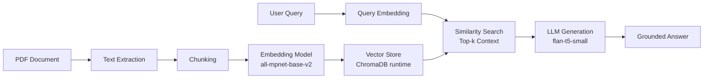

# Full-Stack RAG Chat Application

<p align="center">
	<strong>Document upload, ChromaDB retrieval, Spring Boot gateway, JWT auth, SSE streaming, and a Next.js chat UI.</strong><br/>
	A local full-stack Retrieval-Augmented Generation project built from a cleaned Python RAG core.
</p>

<p align="center">
	
	
	
	
</p>

---

## Why This Repo Exists

Most RAG tutorials stop at a notebook.
This project turns the RAG pipeline into a runnable application: upload documents, index them into ChromaDB, ask questions through a secured Spring Boot gateway, and stream answers into a Next.js chat UI.

### What makes it interesting

- FastAPI RAG service for chunking, embedding, retrieval, and answer construction
- ChromaDB vector storage instead of CSV-as-runtime-storage
- Spring Boot API gateway with JWT auth, rate limiting, and SSE proxying
- Next.js black chat interface with document upload/list/delete management
- Tests for core Python RAG behavior plus Spring gateway security/chat paths

---

## Architecture At A Glance



---

## Tech Stack

- Python 3.12 recommended
- PyTorch + CUDA
- sentence-transformers
- transformers + accelerate
- bitsandbytes optional for quantization experiments
- PyMuPDF
- pandas / numpy / nltk
- ChromaDB
- FastAPI
- Spring Boot
- Next.js / React / Tailwind

Core files in this repo:

- `advanced_rag.py`: core RAG engine used by the FastAPI service
- `evaluate_rag.py`: golden set evaluation and retrieval/answer dashboards
- `rag_service/`: FastAPI service wrapper for internal backend calls
- `backend-spring/`: Spring Boot API gateway for frontend-facing chat calls
- `frontend-next/`: Next.js chat UI for the public user experience
- `golden_test_set.json`: starter golden benchmark questions
- `requirements.txt`: dependency list
- `install_requirements.ps1`: setup helper script

---

## Quick Start

### 1) Clone and enter the project

```bash
git clone <your-repo-url>
cd retrieve-augmented-generation/rag-pipeline
```

### 2) Create the environment and install dependencies

```powershell
.\install_requirements.ps1
```

By default the helper creates `venv_py312` and installs CUDA 12.1 PyTorch wheels.
It prefers Python 3.12 through the Windows `py` launcher, then falls back to the default `python` on your PATH.
If PyTorch is already installed, run `.\install_requirements.ps1 -SkipTorch`.
If you want optional quantization tooling, run `.\install_requirements.ps1 -InstallBitsAndBytes`.

### 3) Activate the environment

```powershell
venv_py312\Scripts\Activate.ps1
```

### 4) Run the application

Terminal 1, Python RAG service:

```powershell
python -m uvicorn rag_service.main:app --host 127.0.0.1 --port 8000
```

Terminal 2, Spring Boot gateway:

```powershell
cd backend-spring
mvn spring-boot:run
```

Terminal 3, Next.js frontend:

```powershell
cd frontend-next
npm install
npm run dev
```

Open `http://127.0.0.1:3000`, sign in with `demo` / `demo123`, upload a PDF/TXT/Markdown document, and ask questions.

---

## Run Flow

1. Upload a PDF, TXT, or Markdown file from the Next.js sidebar.
2. FastAPI extracts text, chunks it, embeds it, and stores vectors in ChromaDB.
3. The chat UI sends questions to Spring Boot with a JWT bearer token.
4. Spring applies auth/rate limiting and forwards the query to FastAPI.
5. FastAPI retrieves grounded context and returns citations.
6. Spring streams the answer back to Next.js over SSE.

---

## Project Structure

```text
rag-pipeline/
|- install_requirements.ps1
|- advanced_rag.py
|- evaluate_rag.py
|- golden_test_set.json
|- requirements.txt
|- architecture.md
|- rag_service/                       # FastAPI internal RAG service
|- backend-spring/                    # Spring Boot API gateway
|- frontend-next/                     # Next.js chat UI
|- tests/                             # Python unit/API tests
|- chroma_db/                         # generated local ChromaDB store, gitignored
|- documents/                         # uploaded local documents, gitignored
```

---

## Customization Ideas

- Swap embedding model for speed vs quality experiments
- Add reranking step after initial retrieval
- Add chat history persistence
- Add multi-user document ownership
- Add CI for Python, Spring, and Next.js checks

---

## Phase 1 Optimization Features Implemented

The repo now includes a reusable advanced RAG engine with:

- Hybrid retrieval (dense + BM25 + reciprocal rank fusion)
- Token-aware chunking with overlap
- Cross-encoder reranking
- Citation-grounded context formatting
- Abstain/fallback behavior when evidence is weak
- Query rewriting + adaptive top-k
- Metadata filtering
- Caching for retrieval/answer reuse
- Governance controls (source allow/deny + PII masking)

### Optional Usage: CSV Bootstrap + Grounded Answer

The full-stack app no longer needs the old notebook.
If you separately generate a `text_chunks_and_embeddings_df.csv`, the Python engine can still import it for experiments or ChromaDB bootstrap.

```python
from transformers import pipeline
from advanced_rag import RAGConfig, build_engine_from_embeddings_csv

config = RAGConfig(
	default_top_k=5,
	abstain_threshold=0.35,
	source_allowlist=["book"],
)

engine = build_engine_from_embeddings_csv("text_chunks_and_embeddings_df.csv", config=config)

generator = pipeline("text2text-generation", model="google/flan-t5-small")

def llm_call(prompt: str) -> str:
	out = generator(prompt, max_new_tokens=220, do_sample=False)
	return out[0]["generated_text"]

response = engine.answer(
	query="How does RAG reduce hallucination?",
	llm_callable=llm_call,
	filters={"min_page": 1},
)

print(response["answer"])
print(response["citations"])
```

### Quick Usage: Golden Set + Dashboards

```python
from evaluate_rag import load_golden_set, run_eval_suite

cases = load_golden_set("golden_test_set.json")

results = run_eval_suite(engine, cases, llm_callable=llm_call, k=5, output_dir="reports")

print(results["retrieval_summary"])
print(results["answer_summary"])
print(results["artifacts"])
print(results["summary_report"])
```

### CLI Evaluation Runner

```powershell
python evaluate_rag.py --index text_chunks_and_embeddings_df.csv --golden golden_test_set.json --output reports
```

This writes:

- `reports/retrieval_eval.csv`
- `reports/answer_eval.csv`
- `reports/retrieval_metrics.png`
- `reports/answer_metrics.png`
- `reports/evaluation_summary.md`

---

## FastAPI RAG Service

The application calls a FastAPI wrapper around the RAG engine.
The service uses ChromaDB as the runtime vector store by default and treats the embeddings CSV as a bootstrap/import file.

```powershell
uvicorn rag_service.main:app --host 127.0.0.1 --port 8000 --reload
```

Open:

- `http://127.0.0.1:8000/health`
- `http://127.0.0.1:8000/docs`

Useful endpoints:

- `GET /health`: service and Chroma index status
- `POST /index/load`: import/load the embeddings CSV into ChromaDB
- `GET /documents`: list uploaded/indexed documents
- `POST /documents/upload`: upload and index PDF, TXT, or Markdown
- `DELETE /documents/{document_id}`: delete an uploaded document and its vectors
- `POST /retrieve`: retrieve relevant chunks from ChromaDB
- `POST /query`: retrieve context and return a grounded answer
- `POST /query/stream`: SSE token stream for chat-style clients

To force a clean Chroma rebuild from the CSV:

```powershell
Invoke-RestMethod `
  -Method Post `
  -Uri http://127.0.0.1:8000/index/load `
  -ContentType "application/json" `
  -Body '{"reset_vector_store":true}'
```

Upload a document directly to the internal service:

```powershell
$form = @{
  file = Get-Item .\notes.md
  source = "notes"
}
Invoke-RestMethod `
  -Method Post `
  -Uri http://127.0.0.1:8000/documents/upload `
  -Form $form
```

Example request:

```powershell
Invoke-RestMethod `
  -Method Post `
  -Uri http://127.0.0.1:8000/query `
  -ContentType "application/json" `
  -Body '{"query":"How does RAG reduce hallucination?","top_k":5}'
```

By default the service uses an extractive fallback answer so it can run without an LLM provider.
It also defaults `RAG_MODEL_LOCAL_FILES_ONLY=true`, which avoids surprise model downloads during API requests.
Set it to `false` if you want the service to download Hugging Face models on demand.
Set `RAG_VECTOR_BACKEND=memory` only if you want the older CSV/tensor in-memory backend for debugging.
For Ollama generation, start Ollama locally and set:

```powershell
$env:RAG_MODEL_LOCAL_FILES_ONLY="false"
$env:RAG_LLM_PROVIDER="ollama"
$env:OLLAMA_MODEL="llama3.2"
uvicorn rag_service.main:app --host 127.0.0.1 --port 8000 --reload
```

Spring Boot should call this service internally at `POST /query`; the public frontend should call Spring Boot, not this Python service directly.

---

## Spring Boot API Gateway

The Spring Boot gateway is the public backend layer from the architecture diagram.
It accepts frontend chat requests, validates JWT bearer tokens, rate-limits chat calls, calls the internal Python RAG service with a typed HTTP client, and returns a frontend-friendly response.

Run the Python RAG service first:

```powershell
uvicorn rag_service.main:app --host 127.0.0.1 --port 8000 --reload
```

Then start the gateway:

```powershell
cd backend-spring
mvn spring-boot:run
```

By default, the gateway listens on `http://127.0.0.1:8080` and calls the Python service at `http://127.0.0.1:8000`.
Override the internal RAG URL with:

```powershell
$env:RAG_SERVICE_BASE_URL="http://127.0.0.1:8000"
mvn spring-boot:run
```

Gateway endpoints:

- `POST /api/auth/token`: development JWT token endpoint
- `GET /api/documents`: list uploaded documents
- `POST /api/documents/upload`: upload and index a document
- `DELETE /api/documents/{documentId}`: delete document vectors and stored file
- `POST /api/chat`: frontend chat request/response
- `POST /api/chat/stream`: SSE stream proxy for chat UI
- `GET /actuator/health`: gateway health

Example:

```powershell
$token = (Invoke-RestMethod `
  -Method Post `
  -Uri http://127.0.0.1:8080/api/auth/token `
  -ContentType "application/json" `
  -Body '{"username":"demo","password":"demo123"}').accessToken

Invoke-RestMethod `
  -Method Post `
  -Uri http://127.0.0.1:8080/api/chat `
  -ContentType "application/json" `
  -Headers @{ Authorization = "Bearer $token" } `
  -Body '{"message":"How does RAG reduce hallucination?","topK":5,"filters":{"source":"book"}}'
```

Useful gateway environment variables:

- `JWT_SECRET`: HS256 signing secret, at least 32 bytes
- `JWT_DEMO_USERNAME`: local login username, default `demo`
- `JWT_DEMO_PASSWORD`: local login password, default `demo123`
- `JWT_TOKEN_TTL`: token lifetime, default `1h`
- `RATE_LIMIT_CAPACITY`: request burst size, default `30`
- `RATE_LIMIT_REFILL_TOKENS`: refill amount, default `30`
- `RATE_LIMIT_REFILL_PERIOD`: refill interval, default `1m`

Current gateway scope:

- API gateway boundary
- request validation
- Python RAG service bridge
- REST chat endpoint
- SSE chat endpoint
- JWT authentication
- in-memory rate limiting
- downstream timeout/error handling

Next backend addition should be persistence for users/chat history.

---

## Next.js Chat UI

The Next.js app is the frontend layer from the architecture diagram.
It renders a black chat interface, streams answers through the Spring Boot gateway, and displays citations returned by the RAG pipeline.
Sign in with the gateway credentials, defaulting to `demo` / `demo123` for local development.

Start the Python RAG service first:

```powershell
python -m uvicorn rag_service.main:app --host 127.0.0.1 --port 8000
```

Start Spring Boot:

```powershell
cd backend-spring
mvn spring-boot:run
```

Then start the frontend:

```powershell
cd frontend-next
npm install
npm run dev
```

Open:

```text
http://127.0.0.1:3000
```

By default, the Next.js route handlers proxy to Spring Boot at `http://127.0.0.1:8080`.
Override it with:

```powershell
$env:SPRING_GATEWAY_URL="http://127.0.0.1:8080"
npm run dev
```

Frontend routes:

- `/`: chat UI
- `/api/token`: server-side proxy to Spring `POST /api/auth/token`
- `/api/documents`: server-side proxy to Spring `GET /api/documents`
- `/api/documents/upload`: server-side proxy to Spring `POST /api/documents/upload`
- `/api/documents/{documentId}`: server-side proxy to Spring `DELETE /api/documents/{documentId}`
- `/api/chat`: server-side proxy to Spring `POST /api/chat`
- `/api/chat/stream`: server-side proxy to Spring `POST /api/chat/stream`

---

## Tests

Run the Python test suite with:

```powershell
pytest tests -q
```

Current coverage includes:

- token-aware chunking and overlap behavior
- retrieval fallback, filtering, and PII masking
- grounded answer prompt formatting, citations, and abstain behavior
- FastAPI health and unloaded-index error handling

Run Spring gateway tests with:

```powershell
cd backend-spring
mvn test
```

Run frontend checks with:

```powershell
cd frontend-next
npm run typecheck
npm run build
```

---

## Notes

- 4 GB VRAM works, but model size is constrained
- Better retrieval quality usually gives better answers than bigger generation models
- Keep credentials out of source control; pass tokens via environment variables when required

---

## License

MIT

## Credits

- Hugging Face ecosystem
- Sentence Transformers
- PyTorch

---
