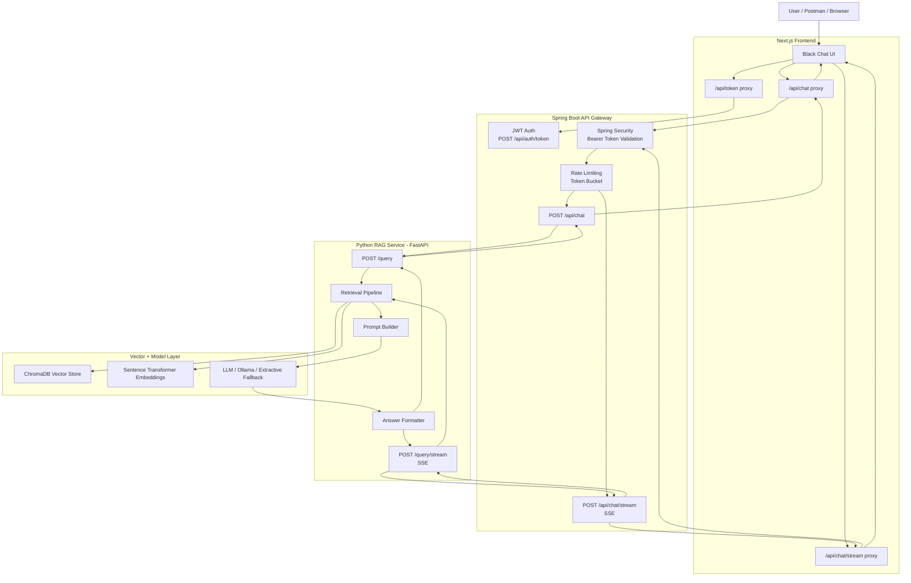

# RAG Project Architecture

```mermaid
flowchart TD
    User["User / Postman / Browser"]

    subgraph Frontend["Next.js Frontend"]
        UI["Black Chat UI"]
        NextChat["/api/chat proxy"]
        NextStream["/api/chat/stream proxy"]
        NextToken["/api/token proxy"]
    end

    subgraph Gateway["Spring Boot API Gateway"]
        Auth["JWT Auth<br/>POST /api/auth/token"]
        Security["Spring Security<br/>Bearer Token Validation"]
        RateLimit["Rate Limiting<br/>Token Bucket"]
        Chat["POST /api/chat"]
        Stream["POST /api/chat/stream<br/>SSE"]
    end

    subgraph RagService["Python RAG Service - FastAPI"]
        Query["POST /query"]
        QueryStream["POST /query/stream<br/>SSE"]
        Retrieve["Retrieval Pipeline"]
        Prompt["Prompt Builder"]
        Answer["Answer Formatter"]
    end

    subgraph DataLayer["Vector + Model Layer"]
        VectorDB["ChromaDB Vector Store"]
        Embeddings["Sentence Transformer Embeddings"]
        LLM["LLM / Ollama / Extractive Fallback"]
    end

    User --> UI
    UI --> NextToken
    UI --> NextChat
    UI --> NextStream

    NextToken --> Auth
    NextChat --> Security
    NextStream --> Security

    Security --> RateLimit
    RateLimit --> Chat
    RateLimit --> Stream

    Chat --> Query
    Stream --> QueryStream

    Query --> Retrieve
    QueryStream --> Retrieve

    Retrieve --> VectorDB
    Retrieve --> Embeddings
    Retrieve --> Prompt
    Prompt --> LLM
    LLM --> Answer

    Answer --> Query
    Answer --> QueryStream

    Query --> Chat
    QueryStream --> Stream

    Chat --> NextChat
    Stream --> NextStream

    NextChat --> UI
    NextStream --> UI
```
